# Instalasi Git

1. Download master `git` melalui source link dari [git-scm](https://git-scm.com/download/win)

   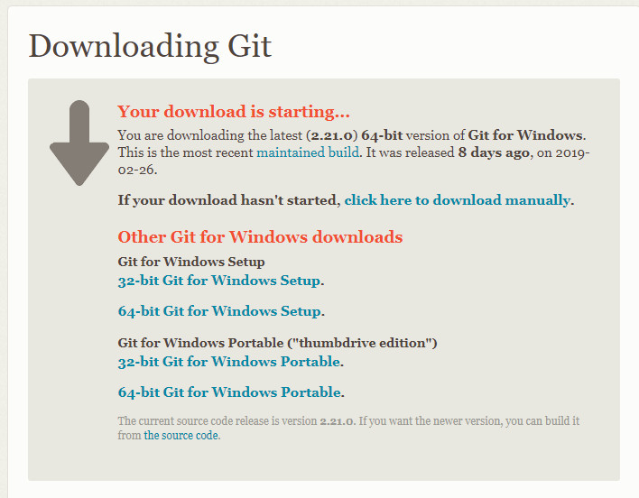

2. Setelah selesai proses download file installer, double click pada file untuk menjalankan proses instalasi git pada komputer.

   

   Setelah itu akan muncul halaman informasi licensi dari installer git. Klik **Next** untuk melanjutkan instalasi.

   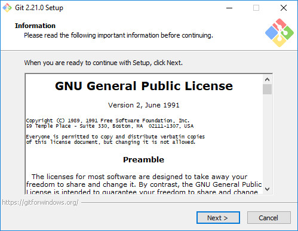

3. Langkah selanjutnya adalah menentukan letak instalasi git, secara default git akan terinstall di _C:\Program Files\Git_. Ubah lokasi jika ingin meletakkan instalasi git di tempat yang diinginkan.

   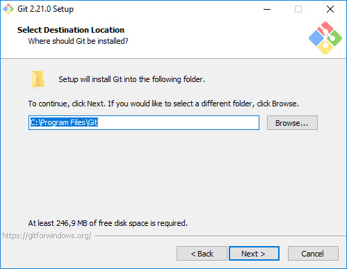

   Selain menunjukkan letak instalasi, pada halaman ini juga menampilkan informasi disk space pada partisi disk yang menjadi tujuan. Klik **Next** untuk melanjutkan proses instalasi.

4. Pada langkah ini terdapat pilihan komponen yang akan di sertakan pada instalasi git di komputer, jika ragu abaikan pilihan komponen, biarkan secara default kemudian klik **Next**

   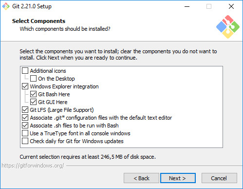

5. **Select Start Menu Folder** sesuai namanya, halaman ini di gunakan untuk menentukan nama folder pada start menu untuk mengelompokkan nama aplikasi dari instalasi git sehingga bisa di akses melalui start menu. Secara default pada start menu akan muncul kelompok menu dengan nama **Git** ubah sesuai keinginan, atau centang pada checkbox _**Don't create a Start Menu folder**_ jika tidak ingi muncul kelompok menu **Git** pada **Start Menu**. Kemudian klik **Next** untuk melanjutkan.

   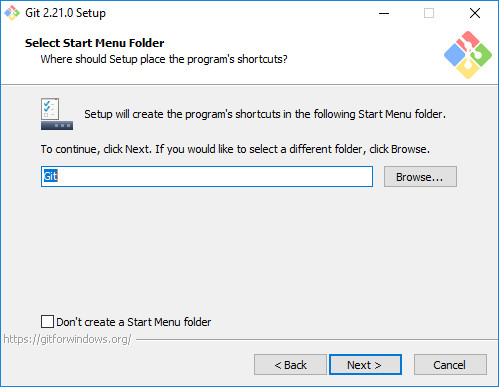

6. **Choosing the default editor used by git** pilih editor default yang akan di gunakan untuk proses editing jika membuka/edit file melalui git gui. Klik pada panah ke bawah dropdown untuk menampilkan daftar text editor yang sudah ada di dalam komputer.

   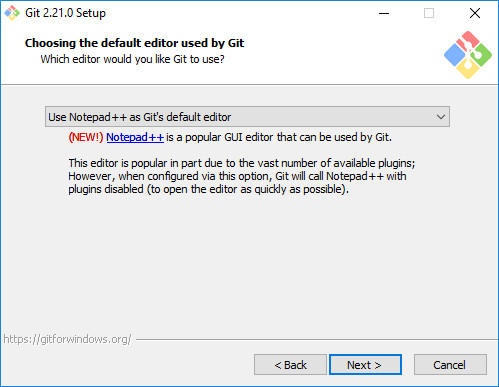

7. Pada saat instalasi, Git menyediakan akses git melalui Bash maupun command prompt. Pilih pilihan kedua supaya bisa menggunakan dari dua antarmuka tersebut. Bash adalah shell di Linux. Dengan menggunakan bash di Windows, pekerjaan di command line Windows bisa dilakukan menggunakan bash - termasuk ekskusi dari Git.

   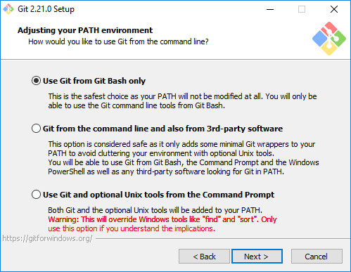

8. **HTTPS transport backend** Pilih OpenSSL untuk HTTPS. Git menggunakan protocol https untuk akes ke repo GitHub atau repo-repo lain (GitLab, Assembla).

   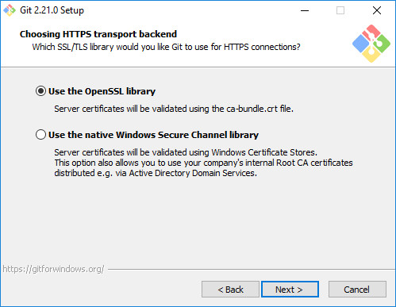

9. **Configuring the line ending conversion** Pilih pilihan pertama untuk konversi akhir baris (CR-LF).

   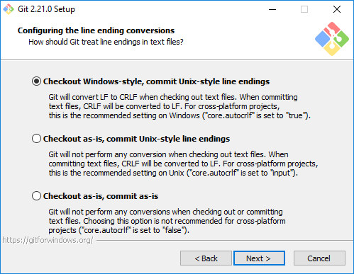

10. **Configuring the terminal emulator to use with Git Bash** Pilihan terminal emulator (Tampilan halaman terminal) yang dipakai oleh Git Bash. Pilih default MinTTY

    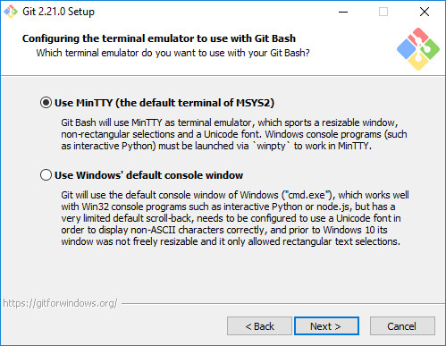

11. **Configuring extra options** Centang fitur tambahan yang akan ikut di sertakan dalam instalasi. Pilih pilihan 1 dan 2 (default)

    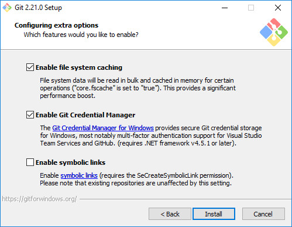

12. **Installing** Proses instalasi berjalan.

    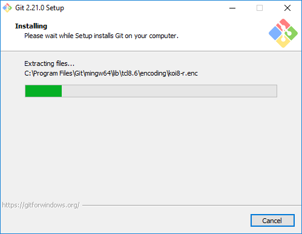

13. **Finish instaling git** Klik **Finish** dan proses instalasi selesai. Cek instalasi, dengan membuka start menu, cari group menu **Git**

    

    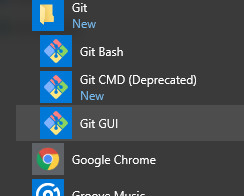

14. **Menjalankan Git** pada start menu, pilih

    1. Git Bash

       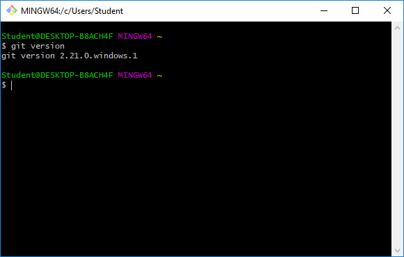

       Tampilan dari git bash ketika di jalankan, untuk memeriksa instalasi git, ketikkan `git version` pada terminal

    2. Git Gui

       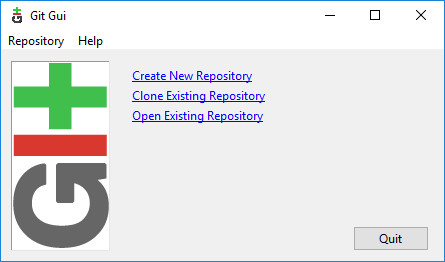

       Tampilan git gui. Terdapat beberapa menu untuk memulai `create new repository`, `Clone existing repository`, `Open existing repository`

[<< Kembali](README.md)
