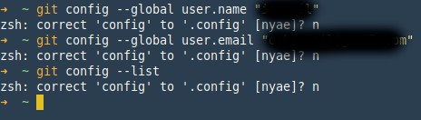
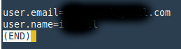

# Konfigurasi GIT

Ada beberapa konfigurasi yang harus dupersiapakan sebelum mulai menggunakan Git, seperti _name_ dan _email_.



```bash
git config --global user.name "git-username"
git config --global user.email "git-email"
```

Syntax diatas adalah perintah untuk konfigurasi git secara global, artinya semua git repository yang ada di local, perintah git akan menggunakan username dan email di atas.

Git menggunakan bermacam-macam file konfigurasi ketika command `git` dijalankan. File konfigurasi pertama Git adalah di file `/etc/gitconfig`, yang berisi nilai-nilai untuk setiap pengguna di sistem dan semua repositori-repositori masing-masing user. Jika pilihan `--system` disematkan ke perintah `git config`, maka pilihan tersebut akan membaca dan menulis dari file ini secara khusus.

Tempat selanjutnya yang akan dilihat oleh Git adalah file `~/.gitconfig` (atau `~/.config/git/config`), yang khusus untuk setiap pengguna. Pada perintah diatas pilihan yang dipakai adalah parameter `--global`, dengan parameter ini git akan menyimpan konfigurasi di dalam file `.git/config`.

Perintah selanjutnya adalah `git config --list`



Adalah perintah untuk menampilkan konfigurasi yang sudah ada seperti tampilan diatas.

File konfigurasi Git merupakan teks biasa, jadi user juga bisa mengatur nilai-nilai tersebut dengan menyunting file secara manual dan memasukkan sintaks yang benar. Umumnya perintah `git config` lebih mudah dijalankan.

[<< Kembali](README.md)
