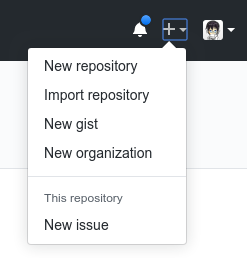
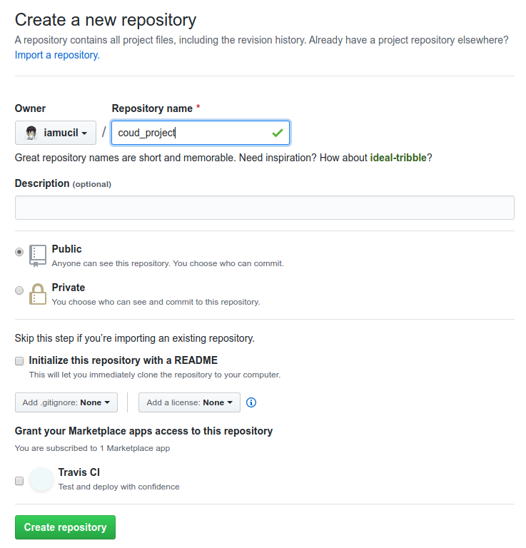
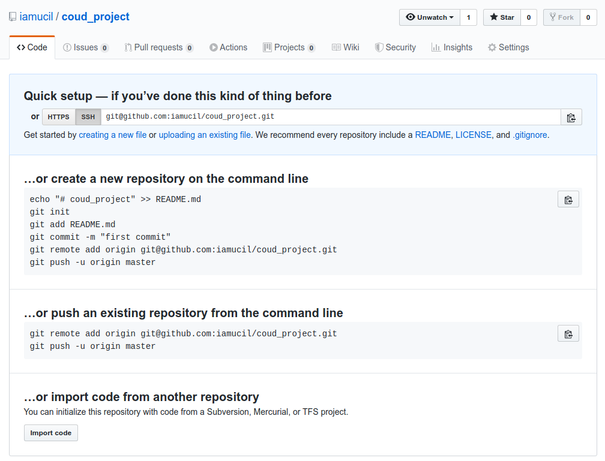
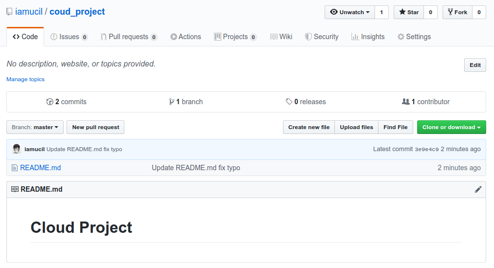

# Mengelola Akun Pribadi

Setiap orang yang terdaftar di dalam [github.com](https://github.com) akan mendapatkan priviledge untuk membuat repository baik public maupun private.

1. Repository public: Setiap user bisa memiliki repository tanpa batas yang bersifat public, dimana source code yang di simpan di dalam repo ini, akan bisa di akses oleh semua orang yang me-akses repo dengan tipe ini.
2. Repository private: Sampai tulisan ini di tulis, github merubah policy nya, setiap user mampu membuat repository private secara gratis dengan segala keterbatasannya untuk medaftarkan collaborator untuk repository yang dibuat.

## Membuat Repository

Pertama login di situs Github dengan username dan password, kemudian klik new repository dengan cara klik tanda panah (+) pada sisi kanan atas sebelah gambar avatar.



Setelah itu akan dihadapkan pada halam baru untuk memebuat repository



    - Repository name : isi dengan nama repository yang di inginkan dan pastikan terdapat tanda centang hijau. Tanda bintang (*) setelah label *Repository name* menandakan field ini harus di isi.
    - Description : Isi deskripsi dari repository yang akan di buat, field ini optional, abaikan jika tidak ingin diisi. Description ini bisa diatur di kemudian hari.
    - Public/Private : Adalah pilihan jenis repository yang akan dibuat. Lihat definisi pada awal halaman untuk lebih detail.
    - Initialize this repository with a README, centang opsi ini untuk menambahkan file README.md pada repository yang akan dibuat, sehingga repository tidak akan kosong.
    - Opsi-opsi selanjutnya bersifat opsional, dan tidak berhubungan langsung dengan project/repository yang akan di buat.

Klik tombol *Create Repository* untuk membuat repository pada akun github.



Gambar diatas adalah halaman pertama yang akan tampil jika repository berhasil dibuat. Karena pada halaman create repository opsi Initialize with a README tidak dipilih, halaman repository akan seperti pada gambar di atas, hal ini dikarenakan repository tidak menemukan file README.md. Repository yang dibuat dapat di askes menggunakan repository [git@github.com:iamucil/coud_project.git](https://github.com/iamucil/coud_project) atau [https://github.com/iamucil/coud_project.git](https://github.com/iamucil/coud_project) tersedia 2 protokol untuk me-akses repository yang dibuat yaitu http dan ssh. Pada praktikum ini menggunakan protokol ssh karena penulis lebih familiar dengan protokol ini.

## Setup repository di lokal

1. Buat folder baru di local dengan nama cloud_project
2. Buat file `README.md` di dalam directory
3. initilize folder sebagai git dengan perintah `git init`

    Git akan membuat sebuah subdirektori baru bernama .git yang akan berisi semua berkas penting dari repositori, yaitu kerangka repositori dari Git. Pada titik ini, belum ada apapun dari proyek Anda yang dipantau.

4. Tambahkan file `README.md` yang baru dibuat dan commit perubahan yang ada di local.
5. Tambahkan remote git berdasarkan url dari repository yang sudah di buat.
6. Kirim perubahan dengan perintah `git push`

Di bawah ini merupakan serangkaian perintah dari langkah-langkah di atas:

```bash
➜  mkdir -p cloud_project
➜  cd cloud_project
➜  echo "# Cloud Project" >> README.md
➜  git init
Initialized empty Git repository in /data/github.com/iamucil/cloud_project/.git/
➜  git add README.md
➜  git commit -am "First commit"
[master (root-commit) 9341384] First commit
 1 file changed, 1 insertion(+)
 create mode 100644 README.md
➜  git remote add origin git@github.com:iamucil/coud_project.git
➜  git push -u origin master
Enumerating objects: 3, done.
Counting objects: 100% (3/3), done.
Writing objects: 100% (3/3), 223 bytes | 223.00 KiB/s, done.
Total 3 (delta 0), reused 0 (delta 0)
To github.com:iamucil/coud_project.git
 * [new branch]      master -> master
Branch 'master' set up to track remote branch 'master' from 'origin'.
```

Lihat perubahan pada halaman repository github:



## Clone Repository

Clone repository adalah sebuah proses untuk menduplikasi repository di local komputer, sehingga kita bisa mengubah dan berkontribusi di dalam repository tersebut. Perintah yang digunakan adalah `git clone url_repository folder_tujuan`

```bash
➜  git clone git@github.com:iamucil/coud_project.git clone_repository
Cloning into 'clone_repository'...
remote: Enumerating objects: 6, done.
remote: Counting objects: 100% (6/6), done.
remote: Compressing objects: 100% (2/2), done.
remote: Total 6 (delta 0), reused 6 (delta 0), pack-reused 0
Receiving objects: 100% (6/6), done.
```

Jika folder tujuan tidak disematkan di akhir perintah, git akan membuat directory baru berdasarkan nama repository. Perintah ini akan membuat sebuah direktori yang dinamakan `clone_repository`, menata awal sebuah direktori `.git` di dalamnya, download semua data dari repositori, dan checkout versi mutakhir ke dalam directory local. Jika masuk ke dalam direktori grit tersebut, kita akan melihat berkas-berkas proyek sudah ada di sana, siap untuk digunakan.

```bash
.
├── ./.git
│   ├── ./.git/branches
│   ├── ./.git/config
│   ├── ./.git/description
│   ├── ./.git/HEAD
│   ├── ./.git/hooks
│   ├── ./.git/index
│   ├── ./.git/info
│   ├── ./.git/logs
│   ├── ./.git/objects
│   ├── ./.git/packed-refs
│   └── ./.git/refs
└── ./README.md
```

[<< Kembali](../README.md)
