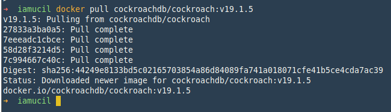
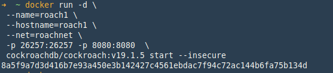
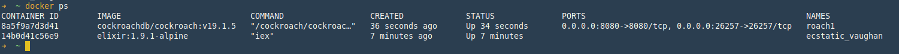
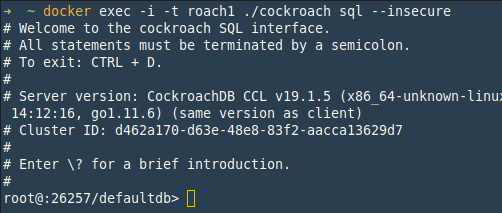
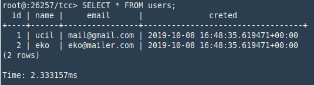
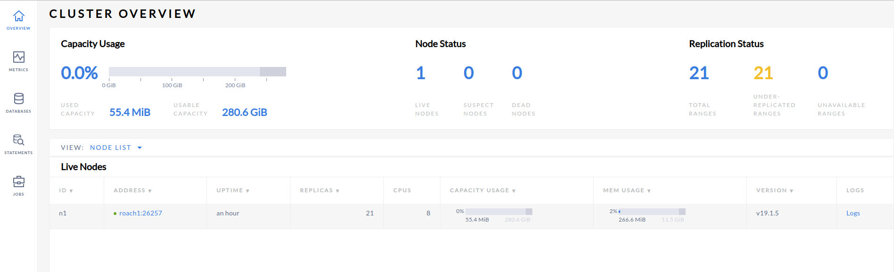
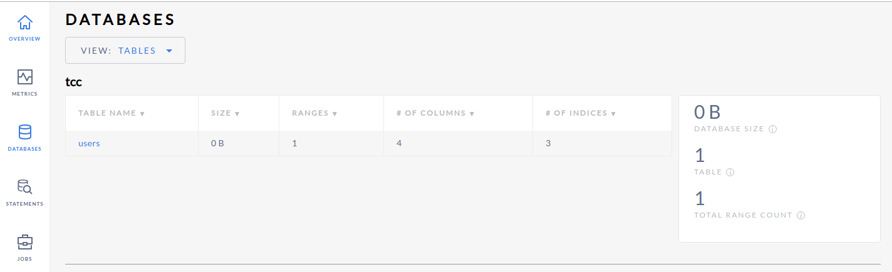
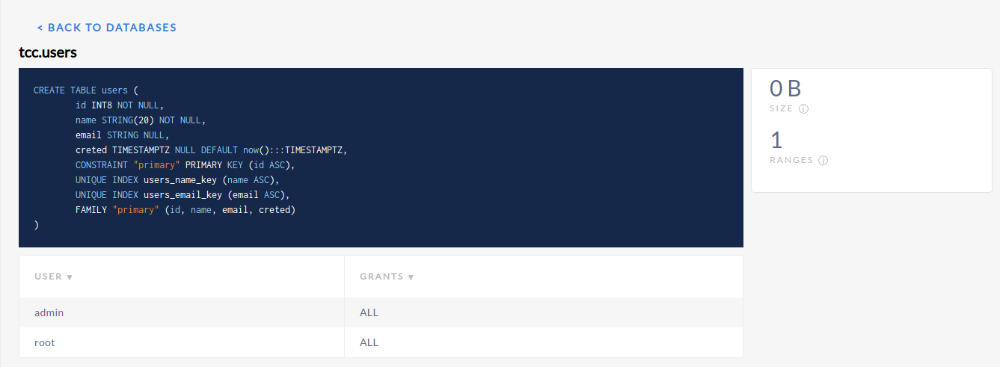
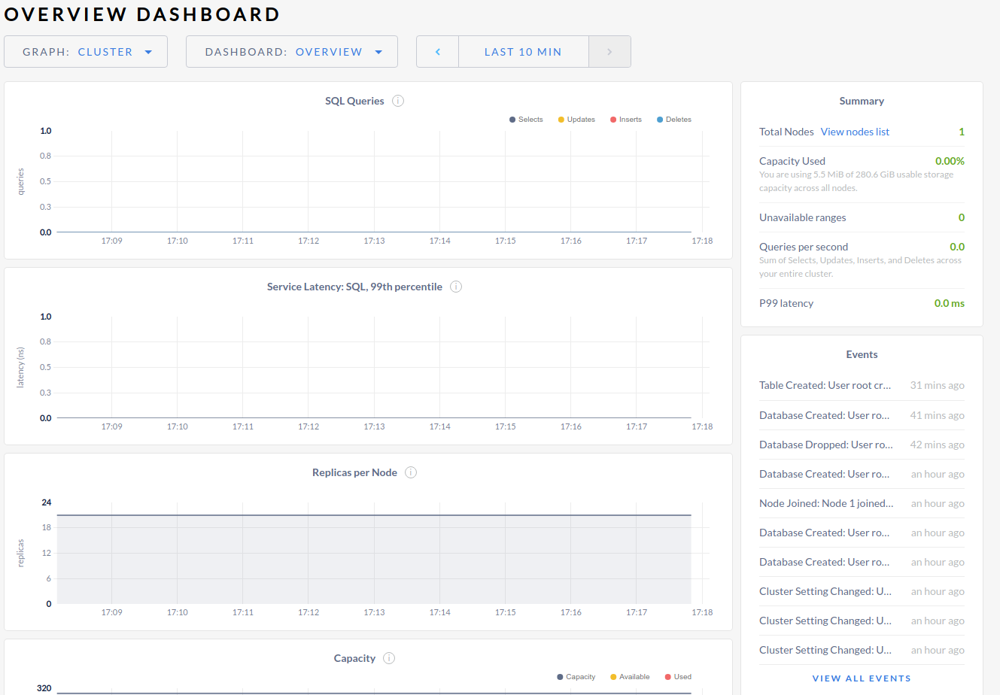

# CockroachDB

> [https://www.cockroachlabs.com](https://www.cockroachlabs.com)

## Instalasi

Instalasi cockroachDB ada beberapa pilihan, tautan instalasi > [Instalasi cockroachDB](https://www.cockroachlabs.com/docs/stable/install-cockroachdb-linux.html)

### Download Binay

Binary file CockroachDB untuk platform linux, membutuhkan `glibc`, `libncurses`, and `tzdata` yang biasanya sudah tersedia pada repo.

1. Download binary cockroachDB dari halaman [archieve](https://binaries.cockroachdb.com/cockroach-v19.1.5.linux-amd64.tgz), dan extract file.

```bash
wget -qO- https://binaries.cockroachdb.com/cockroach-v19.1.5.linux-amd64.tgz | tar  xvz
```

2. Copy file binary ke dalam `PATH`,

```bash
cp -i cockroach-v19.1.5.linux-amd64/cockroach /usr/local/bin
```

Jika perlu gunakan perintah `sudo` untuk copy file binary cockroachDB.

### Kubernetes.

Untuk menjalankan docker menggunakan kubernetes, bisa menggunakan tutorial di bawah ini:

1. [Orkestrasi cockroachDB menggunakan minikube](https://www.cockroachlabs.com/docs/stable/orchestrate-a-local-cluster-with-kubernetes.html)
2. [Orkestrasi cockroachDB pada cluster kuberbetes](https://www.cockroachlabs.com/docs/stable/orchestrate-cockroachdb-with-kubernetes.html)
3. [Orkestrasi cockroach pada multiple cluster](https://www.cockroachlabs.com/docs/stable/orchestrate-cockroachdb-with-kubernetes-multi-cluster.html)

### Docker

1. Pastikan docker sudah terinstall di komputer/laptop dengan menjalankan perintah di bawah ini:

    ```bash
    docker version
    ```

    

2. Pull image cockroachdb dari [Docker HUB](https://hub.docker.com/r/cockroachdb/cockroach/)

    ```bash
    docker pull cockroachdb/cockroach:v19.1.5
    ```

    

### Build dari Source

1. Install kebutuhan-kebutuhan package pendukung di bawah ini:
    - C++ compiler
    - Go >= 1.11.6
    - Bash v4+
    - CMake v3.81+
    - Autoconf >= 2.68

2. Download cockroachDB dari halaman [archieve](https://binaries.cockroachdb.com/cockroach-v19.1.5.src.tgz)

    ```bash
    wget -qO- https://binaries.cockroachdb.com/cockroach-v19.1.5.src.tgz | tar  xvz
    ```

3. `make` dan `build` cockroachDb

    ```bash
    cd cockroach-v19.1.5
    make build
    ```

3. Install dengan perintah `sudo make install`, cockroachDB akan terinstall di directory `/usr/local/bin`, jadi cockroachDB bisa di eksekusi dari lokasi mana saja.

## Menjalankan cockroachDB pada environment Docker

1. Setelah selesai download image cockroachDB dari repository [docker hub]() dengan perintah `docker pull cockroachdb/cockroach:<version>`. buat sebuah network untuk docker, network ini yang akan digunakan ketika menjalankan cockroachDB dengan banyak node.

    ```bash
    docker network create -d bridge roachnet
    ```

2. Jalankan image docker cockroachdb yang sudah di pull dari repository docker hub.

    ```
    $ docker run -d \
    --name=roach1 \
    --hostname=roach1 \
    --net=roachnet \
    -p 26257:26257 -p 8080:8080  \
    cockroachdb/cockroach:v19.1.5 start --insecure

    $ docker ps -as
    ```

    Opsi `-d` digunakan untuk menjalankan container dengan mode detach.
    
    Untuk memastikan container cockroachDB berjalan, perintah `docker ps -a` bisa digunakan untuk melihat container apa saja yang sedang berjalan di dalam komputer host.

    

3. Konfigurasi cluster dengan menginisiasi, cukup di lakukan 1 kali, dengan perintah:

    ```bash
    $ docker exec -it roach1 ./cockroach init --insecure
    ```

## Built-in SQL Client

CockroachDB memiliki built-in sql client, yang bisa digunakan untuk menjalankan query sql. Sama seperti sql-client database yang lain, built-in sql-client dari cockroachDB berjalan pada terminal.

1. Masuk sql-client cockroachDB

    ```bash
    docker exec -it roach1 ./cockroach sql --insecure
    ```

    Untuk tampilan dari built-in sql client bisa dilihat pada gambar di bawah ini.

    

2. Jalankan perintah dasar sql, pada sql-client

    ```bash
    root@:26257/defaultdb> CREATE DATABASE IF NOT EXISTS tcc;
    CREATE DATABASE

    Time: 464.567669ms

    root@:26257/defaultdb> SET database = tcc;
    SET

    Time: 1.014711ms

    root@:26257/tcc> CREATE TABLE IF NOT EXISTS users (
                -> id INT PRIMARY KEY NOT NULL,
                -> name STRING(20) UNIQUE NOT NULL,
                -> email STRING UNIQUE,
                -> creted TIMESTAMPTZ DEFAULT now()
                -> );
    CREATE TABLE

    Time: 1.621838783s

    root@:26257/tcc> INSERT INTO users (id, name, email) VALUES (1, 'ucil', 'mail@gmail.com'), (2, 'eko', 'eko@mailer.com');
    INSERT 2

    Time: 1.355259288s

    root@:26257/tcc> SELECT * FROM users;
    ```

    Perintah di atas secara berurutan:
    - Buat database dengan nama `tcc` jika belum ada database yang bernama `tcc`.
    - Set database yang aktif ke database yang baru di buat yaitu `tcc`.
    - Buat table baru di dalam database `tcc` dengan nama `users` dengan kolom `id`, `name`, `email`, `created` *typo
    - Insert data sample sebanyak 2 data ke dalam table `user`, hasil query `select` dari table untuk validasi query `insert` tampil pada gambar di bawah ini:

    

## Dahboard CockroachDB

Halaman dashboard cockroach DB bisa di akses melalui halaman browser dengan alamat http://localhost:8080, seperti pada gambar di bawah ini.



Halaman ini berisi informasi dari cockroach db yang berjalan pada komputer host. Tidak seperti dashboard db lain (phpmysql, phppgadmin, pgadmin). Halaman dashboard ini hanya sebatas informasi atau overview. Dashboard ini berfungsi untuk memantau kinerja dari cockroach DB.






