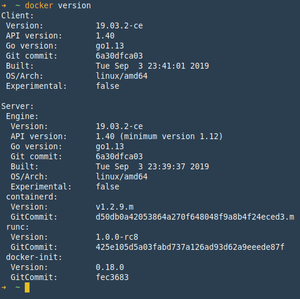
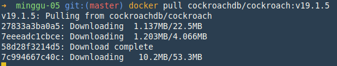

# CockroachDB

> [https://www.cockroachlabs.com](https://www.cockroachlabs.com)

## Instalasi

Instalasi cockroachDB ada beberapa metode yang bisa dijalankan

### Download Binay

Binary file CockroachDB untuk platform linux, membutuhkan `glibc`, `libncurses`, and `tzdata` yang biasanya sudah tersedia pada repo.

1. Download binary cockroachDB dari halaman [archieve](https://binaries.cockroachdb.com/cockroach-v19.1.5.linux-amd64.tgz), dan extract file.

```bash
wget -qO- https://binaries.cockroachdb.com/cockroach-v19.1.5.linux-amd64.tgz | tar  xvz
```

2. Copy file binary ke dalam `PATH`,

```bash
cp -i cockroach-v19.1.5.linux-amd64/cockroach /usr/local/bin
```

Jika perlu gunakan perintah `sudo` untuk copy file binary cockroachDB.

### Kubernetes.

Untuk menjalankan docker menggunakan kubernetes, bisa menggunakan tutorial di bawah ini:

1. [Orkestrasi cockroachDB menggunakan minikube](https://www.cockroachlabs.com/docs/stable/orchestrate-a-local-cluster-with-kubernetes.html)
2. [Orkestrasi cockroachDB pada cluster kuberbetes](https://www.cockroachlabs.com/docs/stable/orchestrate-cockroachdb-with-kubernetes.html)
3. [Orkestrasi cockroach pada multiple cluster](https://www.cockroachlabs.com/docs/stable/orchestrate-cockroachdb-with-kubernetes-multi-cluster.html)

### Docker

1. Pastikan docker sudah terinstall di komputer/laptop dengan menjalankan perintah di bawah ini:

```bash
docker version
```



2. Pull image cockroachdb dari [Docker HUB](https://hub.docker.com/r/cockroachdb/cockroach/)

```bash
docker pull cockroachdb/cockroach:v19.1.5
```



### Build dari Source

1. Install kebutuhan-kebutuhan package pendukung di bawah ini:
    - C++ compiler
    - Go >= 1.11.6
    - Bash v4+
    - CMake v3.81+
    - Autoconf >= 2.68

2. Download cockroachDB dari halaman [archieve](https://binaries.cockroachdb.com/cockroach-v19.1.5.src.tgz)

```bash
wget -qO- https://binaries.cockroachdb.com/cockroach-v19.1.5.src.tgz | tar  xvz
```

3. `make` dan `build` cockroachDb

```bash
cd cockroach-v19.1.5
make build
```

3. Install dengan perintah `sudo make install`, cockroachDB akan terinstall di directory `/usr/local/bin`, jadi cockroachDB bisa di eksekusi dari lokasi mana saja.
