# Docker Image

## Instalasi elixir phoenix web framework

Jalankan perintah dibawah ini untuk membuat elixir phoenix project menggunakan existing docker image.
```bash
docker container run --rm -i -t -v $PWD:/data -w /data --entrypoint=sh elixir:1.9.1-alpine
```

Perintah diatas akan membuat kita masuk pada shell dari image elixir. Opsi `-w -data` digunakan untuk membuat working directory dari image ke lokasi yang kita inginkan. Kemudian workingdir kita mount ke lokasi directory local yang akan kita pakai untuk instalasi elixir phoenix framework. Langkah selanjutnya untuk instalasi phoenix di perlukan hex local, install dengan perintah seperti pada gambar di bawah ini.

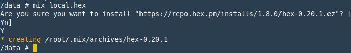

Install phoenix installer dari archive:

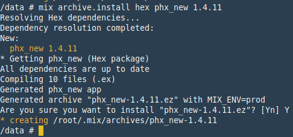

Perintah di atas dilakukan untuk install phoenix installer dari archieve ke local.

### Install phoenix framework

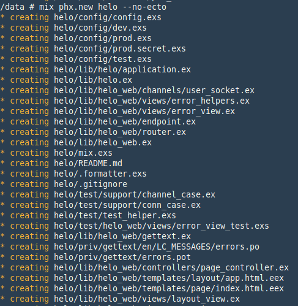

Instalasi ini tidak menggunakan koneksi database, opsi `--no-ecto` disematkan untuk menghilangkan library ecto yang digunakan untuk koneksi ke database. Setelah instalasi berhasil, masuk ke directory project di dalam kasus ini directory `helo` dan jalankan perintah `mix do deps.get` untuk instalasi kebutuhan-kebutuhan dari project, kebutuhan library bisa di lihat pada file `mix.exs`.

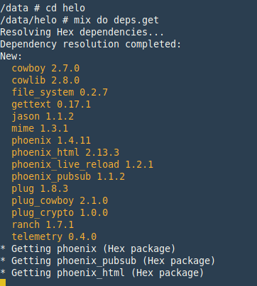

#### Instalasi aset

Phoenix menggunakan nodejs - webpack untuk mengelola asset (css, javascript, dll). Perintah di bawah ini digunakan untuk install asset menggunakan package npm dari nodejs, dan akan membuat folde node_modules di dalam project.

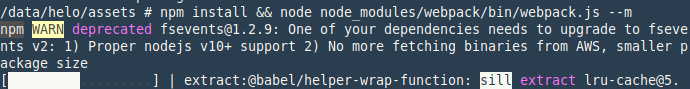

Setelah asset berhasil di-install, build asset menggunakan package webpack. Secara default package ini akan disertakan bersamaan instalasi framework phoenix, check file `package.json` untuk memastikan.

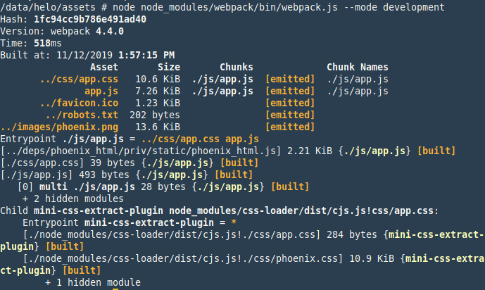

#### Test server

Lakukan test menjalankan server di dalam container yang berjalan dengan perintah `mix phx.server` Jika instalasi berhasil akan muncul seperti pada gambar dibawah ini.

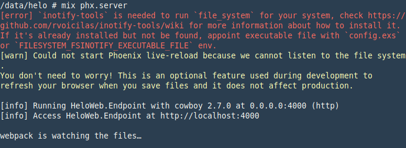

Hentikan server dengan `ctrl + c`.

[Referensi: Instalasi phoenix framework](https://hexdocs.pm/phoenix/installation.html#content)

## Dockerfile

Ketika melakukan instalasi menggunakan container yang sudah ada secara default ownership directory hasil instalasi adalah root, karena user container default adalah root, untuk pengguna OS Windows dan mac hal ini tidak ada kendala. Untuk linux ownership dari directory dari hasil instalasi harus diubah supaya bisa project bisa didevelop menggunakan user biasa (bukan root). Keluar dari container yang berjalan dengan `ctrl + D` dan ubah ownership dari directory menggunakan perintah `chown` gunakan `sudo` karena directory project adalah milik user `root`

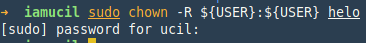.

Tambahkan file `Dockerfile` didalam project directory.

```Dockerfile
FROM bitwalker/alpine-elixir-phoenix

# Set exposed ports
EXPOSE 5000
ENV PORT=5000 \
    MIX_ENV=prod \
    SECRET_KEY_BASE=3X8YqDhlmSdUrz2Se2bQ8CoWIopcGKzcWuZlpX+dR+CCSnCvjgh8DpD4Zm+UAlok
# Cache elixir deps
ADD mix.exs mix.lock ./
RUN mix do deps.get, deps.compile

# Same with npm deps
ADD assets/package.json assets/
RUN cd assets && \
    npm install

ADD . .

# Run frontend build, compile, and digest assets
RUN cd assets/ && \
    npm run deploy && \
    cd - && \
    mix do compile, phx.digest

CMD ["mix", "phx.server"]
```

### Base Image

Docker image ini menggunakan base image dari `bitwalker/alpine-elixir-phoenix` yang sudah terdapat `nodejs`, `npm` dan dependencies lain yang bisa digunakan untuk menjalankan elixir phoenix.

### Environment

Environment default digunakan untuk menjalankan phoenix, dalam kasus ini phoenix diset menggunakan port 5000, `MIX_ENV=prod`, `SECRET_KEY=key`.

### Steps

`Dockerfile` adalah file yang berisi untuk mendefinisikan sebuah aplikasi dan dibungkus menjadi sebuah image yang kemudian akan dijalankan di dalam sebuah container. Step-step di atas, adalah:

`ADD` command ini digunakan untuk menambah file yang ada di local development ke dalam image.

`RUN` command ini digunakan untuk menjalankan perintah-perintah yang bisa dijalankan di dalam container dari base image yang dipakai.

`CMD` command ini adalah perintah yang akan dijalankan ketika docker image di panggil.

[Referensi >> ikuti tautan ini: `Dockerfile`](https://docs.docker.com/v17.09/engine/reference/builder/)


### Build image

Untuk membuat sebuah image docker, gunakan perintah `docker build` hasil dari perintah ini adalah terciptanya sebuah image.

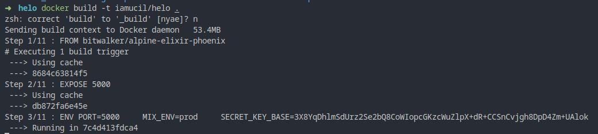

Opsi `-t iamucil/helo` digunakan untuk mendefinisikan nama image, gunakan username dari docker dan diikuti nama image yang diinginkan. `iamucil` disini adalah username repository dari docker hub, dan `helo` adalah nama repository.

Referensi selengkapnya bisa dilihat pada tautan berikut: [docker run reference](https://docs.docker.com/v17.09/engine/reference/commandline/build/#options)

#### Push Image

Push docker image yang ada di local ke repository docker hub. Sebelum melakukan `push` image pastikan sudah login dan terkoneksi dengan docker hub (`docker login`). Jika tidak ada session docker yang aktif, docker akan meminta credentials dari akun docker berupa username dan password untuk bisa lanjut push image.

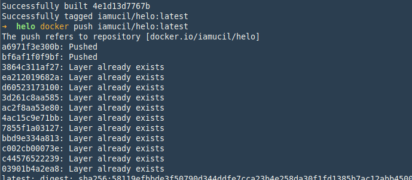

Daftar image docker yang sudah di push ke docker hub repository bisa di lihat pada halaman https://hub.docker.com, login menggunakan akun yang sudah terdaftar. Tampilan dashboard seperti di bawah ini.

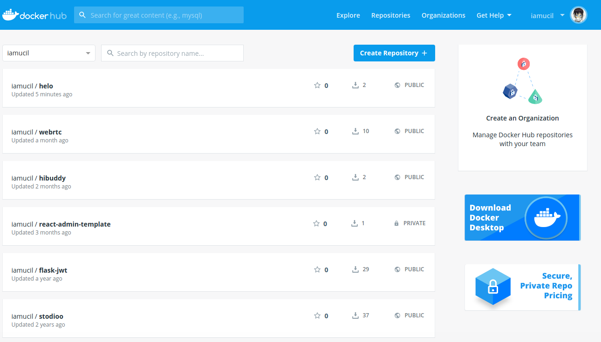

### Run Image

Untuk menjalankan docker image, gunakan perintah `docker run` [Referensi](https://docs.docker.com/v17.09/engine/reference/commandline/run/)

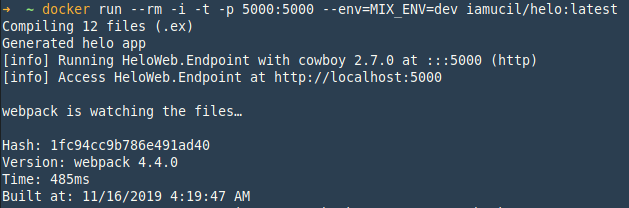

Yang perlu diperhatikan dari perintah di atas adalah parameter `-p 5000:5000`  perintah ini digunakan untuk mengikat port dari container dengan port yang ada di local, format nya adalah `-p LOCAL_PORT:CONTAINER_PORT`. Baca referensi untuk lebih details. Container sudah jalan, untuk mengakses aplikasi buka browser dan akses `localhost:5000`

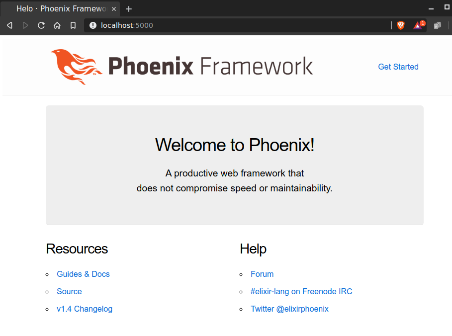
