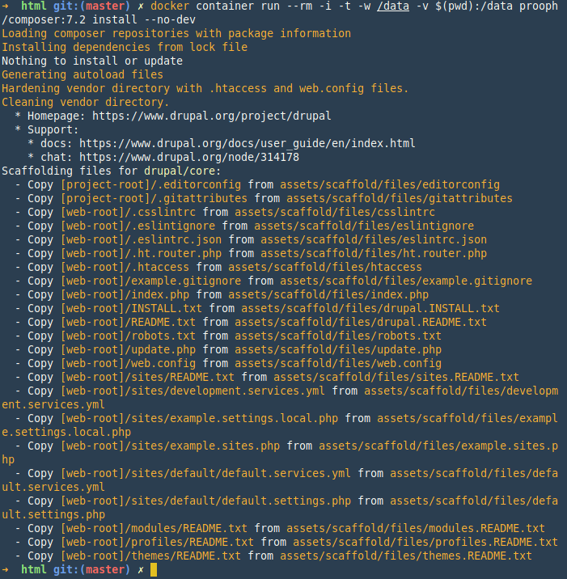
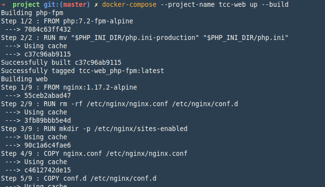
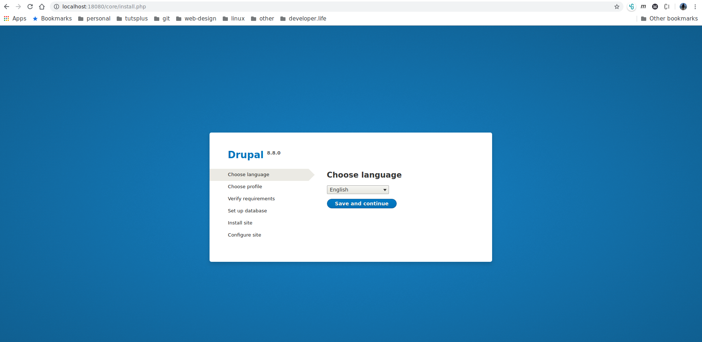

# Docker Compose

> TODO: Menjalankan docker menggunakan docker-compose

Drupal adalah sebuah perangkat lunak sistem manajemen konten yang bebas dan terbuka yang di distribusikan di bawah lisensi GPL, pengembangan dan perawatannya dilakukan oleh ribuan komunitas pengguna dan pengembang di seluruh dunia. Dibuat dengan bahasa pemrograman PHP, Drupal dapat dipasang pada beberapa jenis database seperti MySQL, PostgreSQL, SQLite,MariaDB dan juga MsSQL. Web server yang mendukung diantaranya Apache, Nginx, IIS yang berjalan pada sistem operasi Cross-platform seperti Microsoft Windows, Mac OS X, Linux dan FreeBSD. Drupal dapat diunduh secara bebas dan dapat digunakan secara bebas, sehingga memungkinkan setiap orang baik secara individu maupun komunitas untuk mempublikasi, mengatur, mengelola dan mengorganisir berbagai jenis dari isi/konten pada website. Kemampuannya tidak sekadar sebagai CMS, namun dengan modul API-nya Drupal juga dapat digunakan sebagai CMF dalam membangun aplikasi berbasis Web. [Source: Wikipedia](https://id.wikipedia.org/wiki/Drupal)

## Dependencies

1. Source cms drupal [Dowload source](https://www.drupal.org/download-latest/tar.gz)
2. `nginx` untuk web server
3. `PHPFpm`
4. `MariaDB` untuk database

## Getting Started

Download source drupal dari situs resmi https://www.drupal.org dan extract di dalam directory yang di inginkan. Drupal yang di pakai dalam kasus ini adalah drupal versi 8.8.0 (versi terakhir saat drupal di akses).

```bash
wget https://www.drupal.org/download-latest/tar.gz -O drupal.tar.gz
tar zxvf drupal.tar.gz
```

> `wget` adalah tool downloader yang digunakan untuk download drupal.\
`tar` digunakan untuk extract content dari drupal yang ingin di pakai.

Directory structure untuk drupal.

```bash
.
├── autoload.php
├── composer.json
├── composer.lock
├── core
├── example.gitignore
├── index.php
├── INSTALL.txt
├── LICENSE.txt
├── modules
├── profiles
├── README.txt
├── robots.txt
├── sites
├── themes
├── update.php
├── vendor
└── web.config
```

## docker-compose

```yaml
version: '3'

services:
  cms-db:
    image: mariadb
    ports:
      - "3306:3306"
    environment:
      - MYSQL_ROOT_PASSWORD=mySecretPassw0rd
      - MYSQL_DATABASE=std_services
    volumes:
      - drupal-db:/var/lib/mysql
  php-fpm:
    build:
      context: .
      dockerfile: ./php/Dockerfile
    volumes:
      - ./html:/usr/share/nginx/html
  web:
    build:
      context: .
      dockerfile: ./Dockerfile
    ports:
      - "18080:8080"
    depends_on:
      - cms-db
      - php-fpm
    volumes:
      - ./html:/usr/share/nginx/html
volumes:
  drupal-db:
    external: true
```

Buat volume dengan nama `drupal-db` untuk menyimpan data dari database mariadb, supaya data tidak langsung hilang ketika docker-compose di berhentikan dan di start ulang.

```bash
docker volume create drupal-db
```

Terdapat 3 services di dalam `docker-compose.yaml` di atas, yaitu:

+ cms-db: yaitu database dari image mariadb untuk menyimpan data
+ php-fpm: Berisi php yang digunakan untuk menjalankan drupal
+ web: service ini berisi `nginx` yaitu web server

```
FROM nginx:1.17.2-alpine
RUN rm -rf /etc/nginx/nginx.conf /etc/nginx/conf.d
RUN mkdir -p /etc/nginx/sites-enabled
COPY nginx.conf /etc/nginx/nginx.conf
COPY conf.d /etc/nginx/conf.d
COPY sites-available /etc/nginx/sites-enabled
COPY html /usr/share/nginx/html

EXPOSE 8080
CMD ["nginx", "-g", "daemon off;"]
```

Untuk lebih detail bisa di lihat di dalam directory `project`.

## Install dependencies drupal

Sebelum drupal bisa di jalankan menggunakan `docker-compose` install kebutuhan dari drupal menggunakan composer, berhubung di local tidak ada `composer` yang terinstall, manfaatkan `image docker` yang sudah ada dengan menjalankan perintah:

```bash
docker container run --rm -i -t -w /data -v $(pwd):/data prooph/composer:7.2 composer install --no-dev
```

Perintah di atas akan download image `composer` dari `phpV7.2`, `WORKDIR` di set ke directory `/data` di dalam container dan mount `current directory` ke dalam `/data` dan jalankan perintah `composer install --no-dev`



Perintah `composer install` akan me-install package ke dalam folder `vendor`. [Baca Lebih lanjut > Dokumentasi](https://www.drupal.org/docs/8/install/step-2-install-dependencies-with-composer)

## Jalankan docker-compose

Jalankan service yang ada di dalam `docker-compose.yaml` dengan perintah: `docker-compose --project-name tcc-web up --build`



## Run Installer

Akses melalui `localhost:18080`, browser akan me-redirect ke halaman `/core/install.php`



Konfigurasi drupal dan mulai develop menggunakan drupal

[<< Halaman Utama](../README.md)
